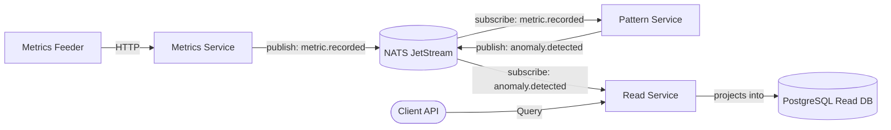

# Anomaly Detection Platform Analysis

This document provides a superficial architectural overview, defining the primary goals, components, integration points, patterns, and current readiness of the project.

# AI Assistant System Rules

You are an expert Go developer assisting with the `anomaly_detection_platform` project.

**CRITICAL DIRECTIVE:**
Before generating any code, modifying the directory structure, or adding dependencies, you MUST read and strictly adhere to the `architecture-code-guide.md` file located in this repository. 

Any code you produce must comply with the following core principles from the guide:

1. **Layered Architecture (Ports and Adapters):** - Domain logic (`internal/domain`, `internal/app`) must remain pure and MUST NOT import packages from `internal/infra`, `internal/store`, or external infrastructure libraries.
   
2. **Zero Magic & Explicit DI:** - Absolutely NO `init()` functions or global state. 
   - All dependency injection and wiring must be done explicitly in the `cmd/.../main.go` file.

3. **Concurrency & Graceful Shutdown:** - Strictly follow the graceful shutdown sequence outlined in the guide. 
   - Bind all background processes and goroutines to a single context tree using `signal.NotifyContext` and `sync.WaitGroup`. 
   - No fire-and-forget goroutines in the data path.

4. **NATS JetStream & PostgreSQL Integration:** - NATS consumers MUST NOT call `msg.Ack()` directly. 
   - Acks/Naks must be passed as closures to the `Projector` and executed ONLY after a successful `tx.Commit()` in PostgreSQL to guarantee at-least-once delivery.
   - Use `pgx/v5` and `pgxpool` for database interactions. Do not introduce heavy ORMs.

5. **Observability:**
   - Adhere strictly to the logging and metrics standards (e.g., using `telemetry.*` constants for labels, never raw strings).
   
If a user request contradicts `architecture-code-guide.md`, you must point out the contradiction and ask for clarification before proceeding.

## 1. Goals
The platform serves as a distributed **Anomaly Detection System** designed to ingest streams of time-series metric data, evaluate them against advanced anomaly detection logic (such as MAD - Median Absolute Deviation), and provide a fast, querying interface for clients to list recognized anomalies in real-time.

## 2. Architecture & Connections
The platform is composed of distinct microservices interconnected via an event-bus, orchestrated efficiently using Docker Compose.

### Microservices
- **metrics-feeder**: A data generation or ingestion agent responsible for funneling raw metrics traffic into the `metrics-service`.
- **metrics-service**: The ingress boundary. It provides an API to record metric series points and publishes them as domain events (`metric.recorded`) to the broker.
- **pattern-service**: The core anomaly processing engine. It subscribes to `metric.recorded` events from the broker, applies statistical anomaly detection algorithms, and publishes an `anomaly.detected` event upon any policy violation.
- **read-service**: The query serving layer. It consumes `anomaly.detected` events, projecting them into structured, normalized Relational Read Models (PostgreSQL), and exposes optimized HTTP REST endpoints for client queries.

### Infrastructure Diagram

## 3. Architectural Patterns
The codebase extensively leverages industry best practices for building distributed, decoupled, and scalable enterprise applications:
* **Event-Driven Architecture (EDA)**: NATS JetStream is utilized as the persistent backbone for asynchronous service-to-service communication.
* **CQRS (Command Query Responsibility Segregation)**: Read and Write paths are physically separate. The `read-service` is strictly dedicated to handling projection queries while other services handle command updates.
* **Event Sourcing / Event Projections**: The system captures state changes as a sequence of immutable domain events, projecting these events into denormalized views (PostgreSQL) optimized for queries.
* **Ports and Adapters (Hexagonal Architecture)**: The Go source code strictly segregates domain rules from infrastructure concerns (using `internal/app/ports`, `internal/infra`, and `internal/ui` packages).

## 4. Readiness
- **Execution Environment**: Fully containerized (`docker-compose.yml`) wiring all services, database (Postgres 16), and message broker (NATS). 
- **Codebase Health**: Rich domain modules, cleanly segregated layers, and existing testing infrastructure (`projector_test.go` and Makefile workflows).
- **Current State**: The platform appears to be in an active development or robust Proof of Concept stage. Minor stubs (e.g., `publisher_stub.go` found in `metrics-service`) indicate an ongoing transition from temporary infrastructure toward complete integration with NATS JetStream. Overall, the foundational structure is solid and production-oriented.
